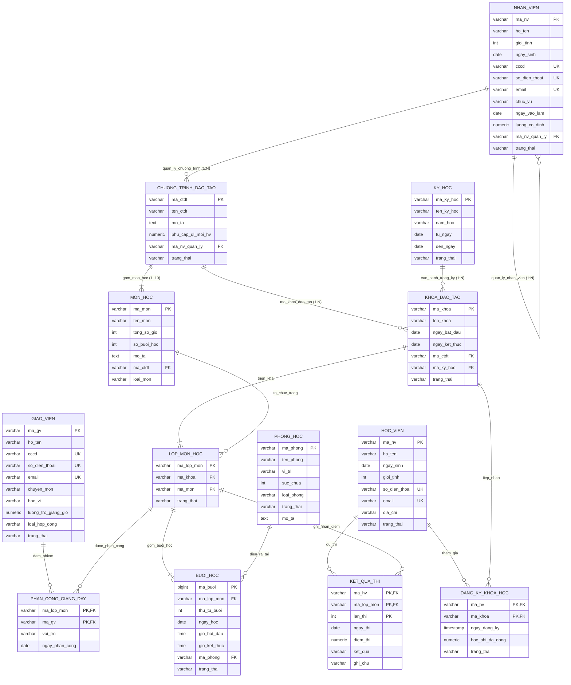

# SƠ ĐỒ QUAN HỆ THỰC THỂ (ERD) - 13 THỰC THỂ TIẾNG VIỆT

Mô hình khái niệm cơ sở dữ liệu quản lý trung tâm đào tạo bao gồm 13 thực thể/bảng chuẩn hóa:

```mermaid
erDiagram
    NHAN_VIEN ||--o{ NHAN_VIEN : "quan_ly_nhan_vien (1:N)"
    NHAN_VIEN ||--o{ CHUONG_TRINH_DAO_TAO : "quan_ly_chuong_trinh (1:N)"
    
    CHUONG_TRINH_DAO_TAO ||--|{ MON_HOC : "gom_mon_hoc (1..10)"
    CHUONG_TRINH_DAO_TAO ||--o{ KHOA_DAO_TAO : "mo_khoa_dao_tao (1:N)"
    
    KY_HOC ||--o{ KHOA_DAO_TAO : "van_hanh_trong_ky (1:N)"
    
    HOC_VIEN ||--o{ DANG_KY_KHOA_HOC : "tham_gia"
    KHOA_DAO_TAO ||--o{ DANG_KY_KHOA_HOC : "tiep_nhan"
    
    KHOA_DAO_TAO ||--|{ LOP_MON_HOC : "trien_khai"
    MON_HOC ||--o{ LOP_MON_HOC : "to_chuc_trong"
    
    GIAO_VIEN ||--o{ PHAN_CONG_GIANG_DAY : "dam_nhiem"
    LOP_MON_HOC ||--o{ PHAN_CONG_GIANG_DAY : "duoc_phan_cong"
    
    LOP_MON_HOC ||--|{ BUOI_HOC : "gom_buoi_hoc"
    PHONG_HOC ||--o{ BUOI_HOC : "dien_ra_tai"
    
    HOC_VIEN ||--o{ KET_QUA_THI : "du_thi"
    LOP_MON_HOC ||--o{ KET_QUA_THI : "ghi_nhan_diem"

    NHAN_VIEN {
        varchar ma_nv PK
        varchar ho_ten
        int gioi_tinh
        date ngay_sinh
        varchar cccd UK
        varchar so_dien_thoai UK
        varchar email UK
        varchar chuc_vu
        date ngay_vao_lam
        numeric luong_co_dinh
        varchar ma_nv_quan_ly FK
        varchar trang_thai
    }

    CHUONG_TRINH_DAO_TAO {
        varchar ma_ctdt PK
        varchar ten_ctdt
        text mo_ta
        numeric phu_cap_ql_moi_hv
        varchar ma_nv_quan_ly FK
        varchar trang_thai
    }

    MON_HOC {
        varchar ma_mon PK
        varchar ten_mon
        int tong_so_gio
        int so_buoi_hoc
        text mo_ta
        varchar ma_ctdt FK
        varchar loai_mon
    }

    KY_HOC {
        varchar ma_ky_hoc PK
        varchar ten_ky_hoc
        varchar nam_hoc
        date tu_ngay
        date den_ngay
        varchar trang_thai
    }

    KHOA_DAO_TAO {
        varchar ma_khoa PK
        varchar ten_khoa
        date ngay_bat_dau
        date ngay_ket_thuc
        varchar ma_ctdt FK
        varchar ma_ky_hoc FK
        varchar trang_thai
    }

    HOC_VIEN {
        varchar ma_hv PK
        varchar ho_ten
        date ngay_sinh
        int gioi_tinh
        varchar so_dien_thoai UK
        varchar email UK
        varchar dia_chi
        varchar trang_thai
    }

    DANG_KY_KHOA_HOC {
        varchar ma_hv PK, FK
        varchar ma_khoa PK, FK
        timestamp ngay_dang_ky
        numeric hoc_phi_da_dong
        varchar trang_thai
    }

    GIAO_VIEN {
        varchar ma_gv PK
        varchar ho_ten
        varchar cccd UK
        varchar so_dien_thoai UK
        varchar email UK
        varchar chuyen_mon
        varchar hoc_vi
        numeric luong_tro_giang_gio
        varchar loai_hop_dong
        varchar trang_thai
    }

    LOP_MON_HOC {
        varchar ma_lop_mon PK
        varchar ma_khoa FK
        varchar ma_mon FK
        varchar trang_thai
    }

    PHAN_CONG_GIANG_DAY {
        varchar ma_lop_mon PK, FK
        varchar ma_gv PK, FK
        varchar vai_tro
        date ngay_phan_cong
    }

    PHONG_HOC {
        varchar ma_phong PK
        varchar ten_phong
        varchar vi_tri
        int suc_chua
        varchar loai_phong
        varchar trang_thai
        text mo_ta
    }

    BUOI_HOC {
        bigint ma_buoi PK
        varchar ma_lop_mon FK
        int thu_tu_buoi
        date ngay_hoc
        time gio_bat_dau
        time gio_ket_thuc
        varchar ma_phong FK
        varchar trang_thai
    }

    KET_QUA_THI {
        varchar ma_hv PK, FK
        varchar ma_lop_mon PK, FK
        int lan_thi PK
        date ngay_thi
        numeric diem_thi
        varchar ket_qua
        varchar ghi_chu
    }
```
